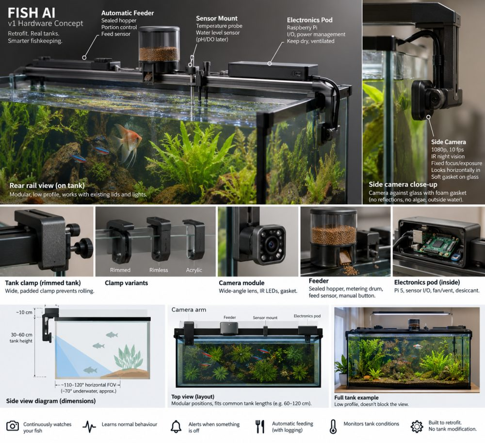

# Hardware v1: decisions after the feasibility review (2026-09-22)

The brief in `HARDWARE_BRIEF.md` asked for a physical feasibility review.
This page records what came back, what we decided, and what changed in the
software because of it. The concept render is `images/v1-concept.jpg`.

## The decision: a smart rail, not a universal lid

Version one is a rigid rear rail that clamps to the existing tank and
carries a camera arm, a feeder, a probe clip and a dry electronics pod.
The owner's own lid and light stay. A universal replacement lid for every
tank size, rim style, light bar and filter is a months-long mechanical
problem that teaches us nothing about whether the fish intelligence is
worth having; the rail gets real footage next week.

## What the review changed

1. **Camera at mid-height, not one third down.** The Pi Camera Module 3
   Wide is 102 x 67 degrees in air; through flat glass into water,
   refraction narrows that to roughly 71 x 49 degrees. From one third down
   a 60 cm tank the substrate does not enter the frame until about 88 cm
   away; from the middle, about 66 cm. The arm therefore places the camera
   near the tank's vertical centre, and the true field is bench-measured
   before any baseline is trusted. The software's zone bands are fractions
   of the FRAME, so they hold wherever the camera sits as long as it is
   level; coverage is what changes, not correctness.
2. **Day and night are different data.** A NoIR sensor gives strong colour
   casts in daylight, and infrared night footage is essentially grey. Fish
   identity relies on flank colour, so the camera needs a switchable IR-cut
   filter, and the software must never compare a night histogram with a
   day one. Sessions now record a lighting mode, appearance descriptors are
   kept per camera and per mode, and a track that lives through dusk is the
   thing that links a fish's day identity to its night identity.
3. **Two cameras designed in, one bought.** An end-pane camera often sees a
   fish head-on rather than its flank and cannot be trusted to re-identify
   small fish at the far end of a 120 cm tank. The pod has a second camera
   connector, and every session carries a camera id so a second camera
   never shares descriptors or baselines with the first.
4. **No mains on the rail.** Camera, sensors, button and feeder motor are
   low voltage. Any AC switching (light, air pump) happens in certified
   smart plugs away from the water. UL 1018 covers household aquarium
   equipment and a Wi-Fi product needs FCC authorisation; both are for the
   production design, not the bench.

## Mount, feeder, sensors, controller

- **Mount:** a wide padded clamp with two separated contact points or an
  anti-rotation key, never a single centre thumbscrew, so the arm cannot
  roll. Removable inserts for rimmed, rimless and acrylic tanks; silicone
  pads on acrylic. Aluminium extrusion or a printed ASA/PETG spine. Not
  suction (creeps), not magnets (wet-side part, scratches, corrosion).
- **Camera hood:** a 20 to 40 mm matte hood with a soft gasket sealing to
  the glass rather than the lens housing touching glass.
- **Feeder:** sealed hopper, metering drum (flakes bridge and jam augers),
  drop chute; the hopper is sealed except while dispensing (the Neptune
  AFS principle). A Hall or optical home sensor confirms a full revolution,
  so "feed commanded" and "feed happened" are different events in the
  log. A physical FEED button goes through the same path as an automatic
  feed. Optional break-beam in the chute later.
- **Sensors v1:** temperature (DS18B20-class, plus or minus 0.5 C) and a
  float switch for low water. pH and dissolved oxygen get a probe position
  and a software interface, not a probe: a pH kit is about 175 dollars and
  a DO kit 340 to 355, both need calibration, and DO is a research
  experiment (surface behaviour versus measured oxygen) for later.
- **Controller:** Raspberry Pi 5 on the rail, capturing with locked
  exposure, gain and colour gains (auto white balance off) and streaming to
  the Windows PC that runs FishAI and the reasoning model. Jetson-class
  hardware only when inference moves on-device. The 200 mm camera ribbon is
  shorter than the arm; a longer FPC is fine on the bench, and the
  production interconnect is decided once the geometry is frozen.
- **Actuation v1:** feeder yes; light, aerator and pump mode through
  certified plugs; **heater is measure-only**. Heater control is FORBIDDEN
  in the permission table for now (`fishai/control/permissions.py`), not
  merely approval-gated, until independent hardware limits exist.

## Bench prototype (next week)

| Part | Rough cost |
|---|---|
| Raspberry Pi 5, 2 to 4 GB | 65 to 85 |
| Camera Module 3 Wide (or NoIR + IR-cut experiment) | ~39 |
| Long camera cable | 5 to 10 |
| Waterproof DS18B20 probe | 6 to 15 |
| Float switch | 5 to 15 |
| IR illumination experiment | 10 to 25 |
| Feeder motor, drum, button, home sensor | 20 to 40 |
| Pi PSU, SD card, cooling | 35 to 60 |
| Arm, clamp, fasteners, printed parts | 25 to 50 |
| **Total** | **210 to 340** |

Ten units: still printed structural parts, because ten real tanks find
the mechanical failures. Production: moulded PC/ABS or glass-filled nylon,
anodised aluminium rail, custom low-voltage controller PCB, pre-certified
wireless module, compliance lab (UL 1018, FCC, IEC 62368-1 as applicable).

## The seven-day test

Rigid clamp, side camera at mid-height, Pi, temperature probe, float
switch, simple feeder. No lid, no pH, no DO, no mains switching, no heater
control, no top camera. Run it for seven days. The question it answers is
not whether we can make a pretty lid; it is whether one fixed camera gives
stable, glare-free, colour-consistent, trackable footage through morning,
daylight, feeding, evening and darkness. Software for that test:
`edge/pi/` on the Pi, `fishai watch --source http://<pi>:8000/stream.mjpg`
on the PC (see `docs/SETUP.md`).

## Answers to the open questions

- One side camera for 120 cm: enough to start collecting behaviour data;
  not enough to bet identity on. Second camera for long tanks, small fish
  and dense aquascapes.
- Top-down camera in v1: no. A mounting point and spare connector, yes.
- Borrow: AquaIllumination's rigid padded rim clamp, Neptune's sealed
  feeder, Innovative Marine and Aqueon's cut-to-fit accessory approach.
  Avoid: goosenecks (calibration moves when bumped), suction as primary
  mount, electronics under the humid lid.
